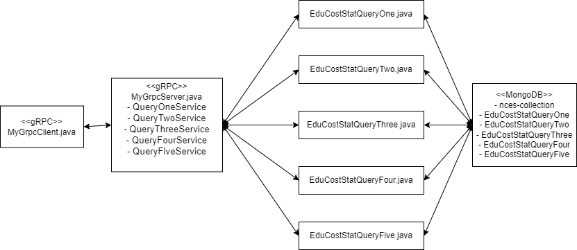

## Introduction
gRPC (gRPC Remote Procedure Call) is an RPC framework developed by Google. It enables efficient communication between distributed systems by defining and serializing structured messages, which are typically protocol buffers (protobufs), and exchanging them over HTTP/2. gRPC facilitates the development of efficient and robust distributed systems. Here’s an explanation of how gRPC facilitates communication for resources and services:

Service Definition: 

In gRPC, communication revolves around defining services
and the methods they expose using Protocol Buffers (protobufs). A .proto file describes the structure of the data exchanged and the remote methods available. Each
service definition includes one or more RPC methods, each with its request and response message types.
Code Generation: Once the service definition is written in a .proto file, gRPC
provides tools to generate client and server code in various programming languages.
These generated classes abstract the complexity of communication over HTTP/2 and
serialization/deserialization of messages in the respective programming languages.

Client-Server Communication:

Client: The client application uses the generated client stub to make remote
procedure calls to the server. The stub abstracts away the networking details,
allowing developers to invoke remote methods as if they were local function calls.

Server: The server implements the generated service interface, handling requests from clients by executing the corresponding method implementations.
The server also handles message serialization, deserialization, and low-level networking tasks.

## Project Structure
Our project architecture follows a robust and scalable design to efficiently handle the retrieval and processing of education cost statistics. At its core, the architecture comprises several key components, each with distinct responsibilities: 

Data Ingestion and Storage: 

The project leverages MongoDB as the primary data store for storing education cost statistics. Data ingestion is facilitated through the importCSVData method, which parses CSV files containing statistical data and inserts them into MongoDB collections.

Data Access Objects (DAOs): 

The DAO layer encapsulates data access logic, providing a clear separation between business logic and data access operations. Each DAO corresponds to a specific query type and is responsible for retrieving relevant data from MongoDB collections. The DAOs ensure efficient data retrieval and manipulation, abstracting away the complexities of MongoDB interactions from the service layer. 

gRPC Services and Protobuf Definition: 

gRPC (Google Remote Procedure Call) is utilized for communication between the client and server components. The query.proto file defines the structure of RPC (Remote Procedure Call) messages exchanged between the client and server. Five gRPC services are implemented, corresponding to the five queries defined in the project’s requirements.

gRPC Server and Client: 

The gRPC server component hosts the implementation of the gRPC services, exposing endpoints for clients to invoke. Each service method is implemented to handle specific query requests, orchestrating data retrieval
and processing through the DAO layer. The gRPC client component allows external clients to interact with the server, making query requests and receiving responses asynchronously.

In principle, the project architecture as shown in Fig 2.1, promotes modularity, scalability, and maintainability by adhering to best practices in distributed systems design and leveraging modern technologies such as gRPC and MongoDB. This architecture enables seamless communication and efficient data processing, empowering users to retrieve and analyze education cost statistics with ease.

